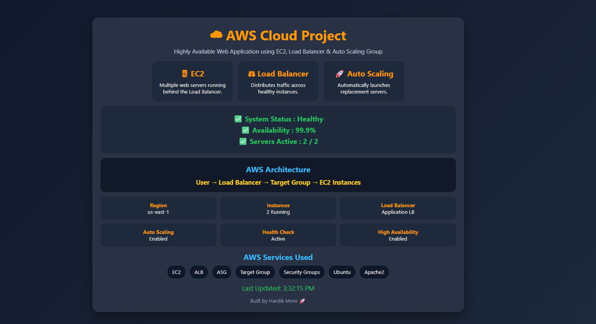
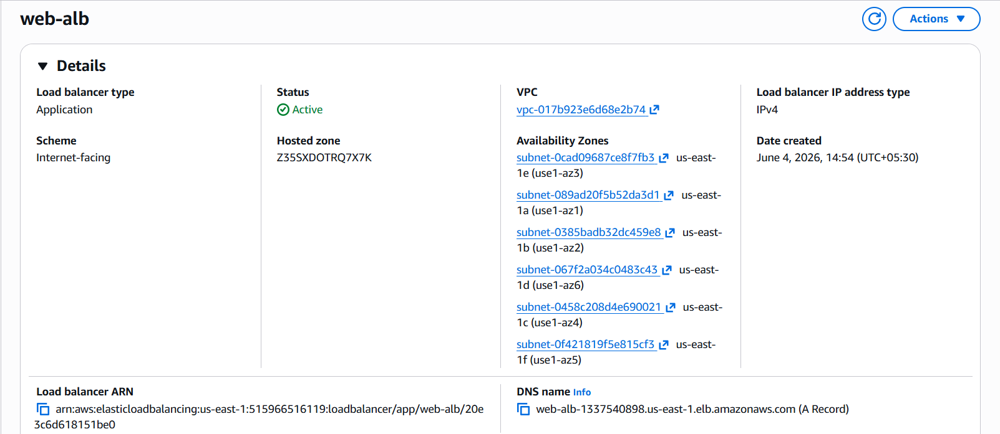
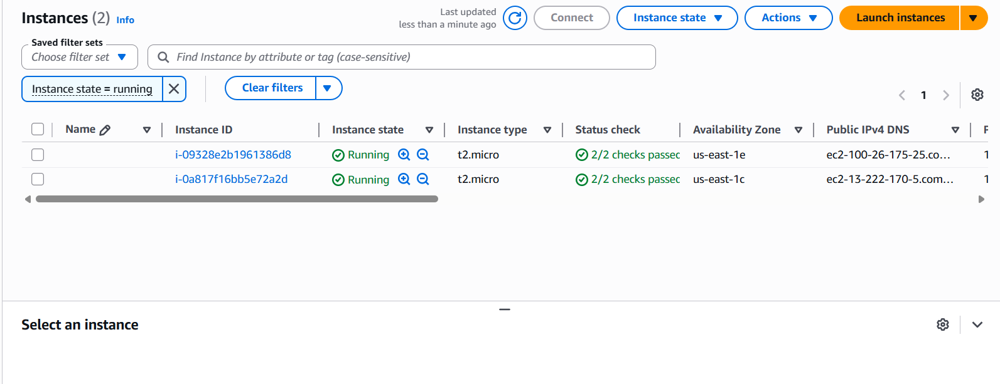

# AWS Load Balancer & Auto Scaling Project

## Overview

Built a Highly Available Web Application on AWS using Amazon EC2, Application Load Balancer (ALB), and Auto Scaling Group (ASG).

This project demonstrates how traffic can be distributed across multiple EC2 instances while maintaining high availability and fault tolerance.

---

## Architecture

User → Application Load Balancer → Target Group → EC2 Instances

---

## AWS Services Used

* Amazon EC2
* Application Load Balancer (ALB)
* Auto Scaling Group (ASG)
* Target Group
* Security Groups
* Ubuntu Linux
* Apache Web Server

---

## Features

✅ High Availability

✅ Load Balancing

✅ Auto Scaling

✅ Health Checks

✅ Automatic Instance Replacement

✅ Responsive Web Dashboard

---

## Region

us-east-1

---

## Project Workflow

1. Launch EC2 Instance
2. Install Apache Web Server
3. Deploy Custom Dashboard
4. Create AMI
5. Create Launch Template
6. Configure Target Group
7. Create Application Load Balancer
8. Create Auto Scaling Group
9. Verify Health Checks
10. Test Automatic Instance Replacement

---

## Screenshots

### Dashboard

### Application Load Balancer

### Auto Scaling Group

### Target Group

### EC2 Instances

---

## Skills Demonstrated

* AWS EC2
* Application Load Balancer
* Auto Scaling Group
* Target Groups
* Linux Administration
* Apache2
* Cloud Infrastructure
* High Availability Architecture

---

## Author

Hardik More

GitHub: https://github.com/hardik7093
